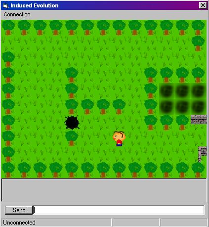



## Simple flicker free RPG Game engine with no directx

### Description

Its a reletively simple RPG engine without directx or api and its flicker free. Its currently a dead game in progress since me and jimcamel shifted it to directx a year or 2 ago.

So its unfinished and has ip connection beginings, including chat and map sending across the net. Theres no map editor since u can do it in notepad. Feel free to use it for your own game, just e-mail me if u want to.
 
### More Info
 

             |
---                |---
**Submitted On**   |2001-01-26 20:55:54
**By**             |[Roger the Camel](https://github.com/Planet-Source-Code/PSCIndex/blob/master/ByAuthor/roger-the-camel.md)
**Level**          |Intermediate
**User Rating**    |3.6 (18 globes from 5 users)
**Compatibility**  |VB 6\.0
**Category**       |[Games](https://github.com/Planet-Source-Code/PSCIndex/blob/master/ByCategory/games__1-38.md)
**World**          |[Visual Basic](https://github.com/Planet-Source-Code/PSCIndex/blob/master/ByWorld/visual-basic.md)
**Archive File**   |[CODE\_UPLOAD141801262001\.zip](https://github.com/Planet-Source-Code/roger-the-camel-simple-flicker-free-rpg-game-engine-with-no-directx__1-14731/archive/master.zip)

